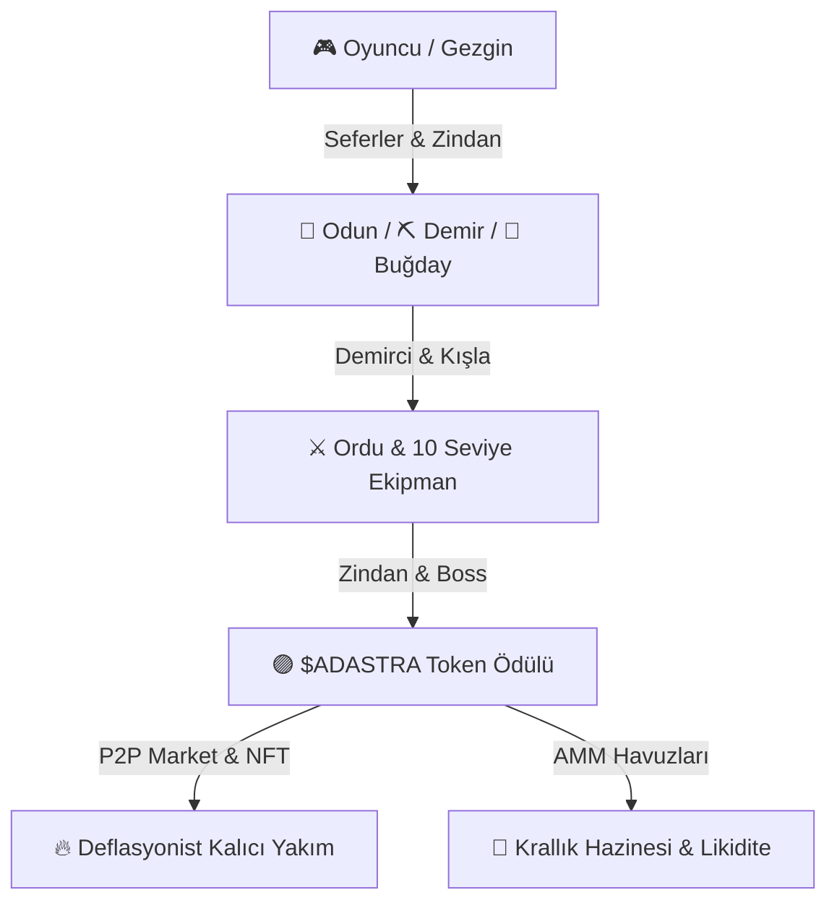
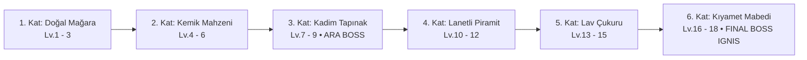

# 🌌 AdAstra: Genesis Realm — Kapsamlı Oyun Tasarımı & Ekonomi Dokümantasyonu (Whitepaper v1.0)

> **Avalanche (AVAX) Ekosisteminde 10 Yıllık Sürdürülebilir Web3 RPG & GameFi Strateji Başyapıtı**  
> **Geliştirici & Vizyoner:** Kağan (AlphAvax)  
> **Teknoloji Mimarisi:** Phaser 3.80 Canvas Rendering • Vanilla ES6+ Modular State Engine • Avalanche C-Chain / Pangolin AMM DEX  

---

## 📑 İÇİNDEKİLER

1. [Proje Vizyonu & Ekosistem](#1-proje-vizyonu--ekosistem)
2. [Karakter Gelişimi & Gezgin İlerlemesi](#2-karakter-gelişimi--gezgin-ilerlemesi)
3. [10 Yıllık Makro Ekonomi & Kıt Kaynak Döngüsü](#3-10-yıllık-makro-ekonomi--kıt-kaynak-döngüsü)
4. [AMM Likidite Havuzları ($x \cdot y = k$) & Swap Dinamikleri](#4-amm-likidite-havuzları-x-cdot-y--k--swap-dinamikleri)
5. [İşçi Seferleri, Sefer Süreleri & Taverna Hızlandırma](#5-işçi-seferleri-sefer-süreleri--taverna-hızlandırma)
6. [Kışla & 18 Kişilik Ordu Yönetimi](#6-kışla--18-kişilik-ordu-yönetimi)
7. [Demirci, 5 Parça Ekipman Üretimi & Akıllı Silah Deposu](#7-demirci-5-parça-ekipman-üretimi--akıllı-silah-deposu)
8. [6 Katlı & 18 Seviyeli Master Zindan Motoru](#8-6-katlı--18-seviyeli-master-zindan-motoru)
9. [18 Koleksiyon Eseri, Kilitli Sandıklar & Genesis NFT](#9-18-koleksiyon-eseri-kilitli-sandıklar--genesis-nft)
10. [Kolezyum & Gladyatör Arenası](#10-kolezyum--gladyatör-arenası)
11. [Haftalık World Boss Ordu Staking Etkinliği](#11-haftalık-world-boss-ordu-staking-etkinliği)
12. [Büyük Krallık Hazinesi & Ödül Havuzları Dağılımı](#12-büyük-krallık-hazinesi--ödül-havuzları-dağılımı)
13. [SDLC Kalite Güvencesi & Test Protokolleri](#13-sdlc-kalite-güvencesi--test-protokolleri)

---

## 1. 🌐 Proje Vizyonu & Ekosistem

**AdAstra: Genesis Realm**, Avalanche blokzincirinde Web3 oyun yayıncılığı ile GameFi stratejisini birleştiren yeni nesil bir ekosistemdir.



### Ekosistem Temelleri:
- **Token:** AdAstra ($ADASTRA)
- **Ana Likidite Havuzu:** Avalanche (Pangolin DEX - AVAX / USDC / ADASTRA)
- **Gelecek Vizyonu:** Kendi bağımsız Avalanche Subnet'i (*AlphaVax Network*) üzerine taşınabilirlik.
- **Deflasyon Politikası:** P2P Pazarında ve NFT minting işlemlerinde harcanan tokenların %100'ü doğrudan yakım adresine gönderilerek arz daraltılır.

---

## 2. 🧙‍♂️ Karakter Gelişimi & Gezgin İlerlemesi

Gezgin (Oyuncu Avatarı), krallığın yönetim ve keşif merkezidir.

| Parametre | Seviye 1 | Seviye 18 | Seviye 81 (MAX) |
| :--- | :--- | :--- | :--- |
| **Maksimum Stamina (⚡)** | 100 | 100 | 100 |
| **Sefer Başına Stamina Tüketimi** | 25 | 25 | 25 |
| **Sefer Süresi** | 18 Dakika (0.3 Saat) | 16.5 Saat | 72 Saat (3 Gün) |
| **Depo Kapasitesi** | 500 Odun / 400 Demir / 800 Buğday | 2.500 Odun / 2.000 Demir / 4.000 Buğday | 20.000+ Hammadde |

### Avatar XP & Seviye Atlama:
- Seferler tamamlanıp toplandığında kazanılan XP'ler doğrudan **ana avatar seviyesine** akar.
- Zindan canavarlarıyla yapılan savaşlardan kazanılan XP'ler ise **yalnızca savaşa katılan askerlere** dağıtılır.

---

## 3. 📉 10 Yıllık Makro Ekonomi & Kıt Kaynak Döngüsü

Oyun içi ekonomi enflasyonu önlemek üzere haftalık katı global çıkarma limitleri üzerine inşa edilmiştir.

### Haftalık Global Kaynak Tavanları:
```text
🌾 Güneş Buğdayı (Wheat) ..... : 490.000 Birim / Hafta
🌲 Zümrüt Meşe Odunu (Wood) ... : 180.000 Birim / Hafta
⛏️ Derin Demir Cevheri (Iron) . : 130.000 Birim / Hafta
```

- **Haftalık Yenilenme:** Her hafta sunucu zamanlayıcısıyla global havuzlar yenilenir; havuzdaki kaynak azaldıkça sefer başına çıkarım miktarı dinamik olarak azalır.
- **Kıtlık Koruması:** Hiçbir kullanıcı sınırsız hammadde üretemez; kaynaklar pazar üzerinden diğer oyunculardan takas edilmek zorundadır.

---

## 4. 💱 AMM Likidite Havuzları ($x \cdot y = k$) & Swap Dinamikleri

Oyun içindeki pazar yeri merkeziyetsiz **Automated Market Maker (AMM)** modeliyle çalışır.

$$\text{Constant Product Formula: } x \cdot y = k$$

* $x$: Havuzdaki Hammadde Rezervi
* $y$: Havuzdaki $ADASTRA Likidite Rezervi

### Fiyatlama Mantığı:
1. **Hammadde Satışı (dx hammadde ver $\to$ dy ADA al):**
   $$dy = \frac{y \cdot dx}{x + dx}$$
2. **Hammadde Alışı (dx hammadde al $\to$ dy ADA öde):**
   $$dy = \frac{y \cdot dx}{x - dx}$$
3. **Kayma (Slippage) & Fiyat Dengelemesi:** Çok yüklü hammadde satışları fiyatı aşağı çekerken, alımlar fiyatı yukarı taşır.

---

## 5. ⏳ İşçi Seferleri, Sefer Süreleri & Taverna Hızlandırma

### Sefer Süresi Formülü:
Seviye 1'de 18 dakika ile başlayan seferler seviye 81'de 72 saate ulaşır:

$$\text{Süre (sn)} = 1080 + (\text{level} - 1) \times 3226.5$$

### Sefer Verimi Matematiksel Formülü:
$$\text{Toplam Çıkarım} = \text{Base\_pm} \times G^{\text{level}-1} \times \left(1 + 0.015 \cdot (\text{level}-1)\right) \times 60 \times \text{DurationHours} \times \text{SpeedMultiplier}$$

* $G_{\text{wood}} = 1.08$, $G_{\text{iron}} = 1.06$, $G_{\text{wheat}} = 1.10$

### 🍺 Taverna Hızlandırıcı İksir Paketleri:
- ⚡ **Kısa Darbe İksiri:** 2 Saat boyunca `1.50x` genel sefer hızı (4.500 ADA)
- ⚡ **Standart Sefer İksiri:** 6 Saat boyunca `1.75x` genel sefer hızı (15.000 ADA)
- ⚡ **Büyük Sefer İksiri (Balina):** 24 Saat boyunca `2.00x` genel sefer hızı (45.000 ADA)

### 🤖 24 Saatlik Otomatik Toplama & Tamir Botu:
Seferler bittiğinde ürünleri otomatik toplar; kazma, balta ve orak kırıldığında depodaki hammadde ve ADA ile aletleri tamir ederek seferleri duraksız sürdürür.

---

## 6. 🛡️ Kışla & 18 Kişilik Ordu Yönetimi

Oyuncu Kışla binasından **18 askere kadar** kendi ordusunu kurabilir.

### Asker Sınıfları & Görevleri:
- 🛡️ **Savaşçı (Warrior):** Yüksek can ve dengeli fiziksel hasar.
- 🏹 **Okçu (Ranger):** Yüksek kritik hasar ve zırh delme.
- 🔮 **Büyücü (Mage):** Zindan canavarlarına karşı element hasarı.
- 🏰 **Şövalye (Paladin):** World Boss savaşlarında en yüksek tank dayanıklılığı.

### Can Yenilenmesi & İyileştirme Mekaniği:
1. **Pasif Buğday İyileşmesi:** Eksik canlar depodaki Güneş Buğdayı tüketilerek 18 saatte %100'e ulaşır (1 HP = 0.5 Buğday).
2. **Anlık Ziyafet İyileşmesi:** Buğday + ADA harcanarak ordu anında savaşa hazır hale getirilir.

---

## 7. 🔨 Demirci, 5 Parça Ekipman Üretimi & Akıllı Silah Deposu

Askerler Demirci binasında üretilen 5 parça ekipmanla donatılır:

```text
🗡️ Silah (Weapon) ... : +ATK Saldırı Gücü
🪖 Miğfer (Helmet) ... : +HP Can Puanı
🛡️ Zırh (Armor) ...... : +HP & Savunma
👖 Pantolon (Legs) ... : +HP & Dayanıklılık
👢 Çizme (Boots) ..... : +HP & Hız
```

- **Seviye Yükseltme (Lv.1 $\to$ Lv.10 Master):** Her seviye ekipmanın temel istatistiklerini **%35** artırır.
- **Akıllı Silah Deposu (Smart Armory):** Tek tıkla depodaki en yüksek ATK/HP veren ekipmanları ordudaki en güçlü askerlere otomatik paylaştırır.

---

## 8. 💀 6 Katlı & 18 Seviyeli Master Zindan Motoru

Zindan sistemi 6 eşsiz görsel kat ve toplam 18 bölümden oluşur.



### Savaş Kuralları:
- **Taktik Formasyon:** Oyuncu 18 askere kadar istediği askerleri savaşa sokabilir.
- **Silah Dayanıklılığı Koruması:**
  - ⚔️ **KAPALI:** Silahın ekstra ATK gücüyle tam güç savaşılır, savaş sonunda silahın dayanıklılığı **-1** aşınır.
  - 🛡️ **AÇIK:** Silahlar aşınmaz, ancak silahın sağladığı ekstra ATK bonusu o savaşta devre dışı kalır.
- **Ganimetler:** Zafer kazanıldığında $ADASTRA ödülü, kat ilerleme kilidi ve savaşa katılan askerlere seviye atlatacak **Asker XP'si** verilir.

---

## 9. 📦 18 Koleksiyon Eseri, Kilitli Sandıklar & Genesis NFT

Zindan canavarlarını yenen gezginlerin **%0.0018** şansla Kilitli Sandık düşürme ihtimali vardır.

### Sandık Açılım Garantisi:
Sandıklardan hiçbir hammadde çıkmaz; **%100 oranında sadece 18 Koleksiyon Eserinden biri çıkar.**

### Rarity Ağırlıkları:
- 🟢 **Yaygın (Common) - %50:** `Kırık Obsidyen Parçası`, `Gümüş Ay Madalyonu`, `Paslı Gladyatör Hançeri`, `Kadim Buğday Başağı`, `Zümrüt Yaprak Mührü`
- 🔵 **Nadir (Rare) - %30:** `Ateş Ruhu Kristali`, `Gölge Taşı Muskası`, `Yıldız Haritası Parşömeni`, `Kemik Lordu Tacı`, `Magma Özü Şişesi`
- 🟣 **Epik (Epic) - %15:** `Ejderha Pulu Zırhı`, `Rünik Şimşek Taşı`, `Karanlık Madenci Kazması`, `Kadim Meclis Mührü`, `Ebedi Güneş Asası`, `Göktaşı Çekirdeği`
- 💎 **Efsanevi (Legendary) - %5:** `Astraeus'un Gözü`, `Genesis Krallık Tacı`

### 👑 Genesis NFT Basımı:
18 eserin tamamını toplayan gezgin, ekosistemin en prestijli varlığı olan **Genesis Realm Master NFT**'sini ücretsiz mint etme hakkı kazanır. Mükerrer çıkan eserler ise P2P pazarında satılabilir.

---

## 10. 🏟️ Kolezyum & Gladyatör Arenası

- **Gladyatör 1v1 Düelloları:** En güçlü şampiyon askerini seçip arenadaki rakiplerle savaş.
- **Arena Anahtarları:** Dövüşlere girmek için kullanılır.
- **Lig Dereceleri:** Bronz, Gümüş, Altın, Elmas ve Şampiyonlar Ligi.
- **Haftalık Ödül Fonu:** Giriş anahtarlarından toplanan ADA'lar lig liderlerine paylaştırılır.

---

## 11. 🌋 Haftalık World Boss Ordu Staking Etkinliği

Her Pazar günü saat 20:00'da **Kadim Kıyamet Behemoth'u (1.000.000 HP)** krallığa saldırır.

- **Ordu Kilitleme (Staking):** Oyuncular tüm ordularını kilitler (Toplam ATK ve HP havuza eklenir).
- **Haftalık 100.000 $ADASTRA Ödülü:** Boss'a verilen toplam hasar oranına göre haftalık ödül havuzu tüm katılımcılara dağıtılır:

$$\text{Kazanılan ADA} = \left( \frac{\text{Verilen Hasar}}{\text{Maksimum Boss Canı}} \right) \times 100.000 \text{ ADA}$$

---

## 12. 🏦 Büyük Krallık Hazinesi & Ödül Havuzları Dağılımı

Üst menüdeki **`🏦 HAZİNE & HAVUZLAR`** paneli krallıktaki tüm rezervleri anlık raporlar:

| Havuz Adı | Rezerv Miktarı | Dağıtım / Amacı |
| :--- | :--- | :--- |
| **🌋 World Boss Havuzu** | `100.000 ADA` | Pazar günleri hasara göre orantılı dağıtım |
| **🏟️ Kolezyum Şampiyonluk Havuzu** | `50.000+ ADA` | Arena galibiyetleri ve haftalık gladyatör fonu |
| **👑 AdAstra Meclisi Staking Havuzu** | `85.000 ADA` | Topluluk oylamaları & VIP bilet sahipleri payı |
| **🗺️ Zindan Ganimet Kasası** | `125.000 ADA` | 18 Seviye zindan canavarlarını yenenlere ödül |
| **🔥 Deflasyonist NFT Yakım Kasası** | `42.500+ ADA` | %18 indirimli pazar alımlarından kalıcı yakılan miktar |
| **💧 AMM DEX Likidite Rezervi** | `3.200.000 ADA` | 4 hammadde havuzunun toplam ADA teminatı |

---

## 13. 🧪 SDLC Kalite Güvencesi & Test Protokolleri

Tüm sistem güncellemeleri **SDLC Doktrini** çerçevesinde sıfır hata ve sıfır regresyon standardıyla teslim edilir:

1. **Statik JS Sözdizimi Taraması:** `node --check` ile tüm motor dosyaları taranır.
2. **Kapsamlı E2E QA Testi:** `sdlc_full_verification.mjs` (Zindan savaşları, 100x kutu açılımı, seviye ilerleme döngüsü, hazine modalları).
3. **E2E UI & Sahne Testi:** `sdlc_runner.mjs` (Phaser sahneleri, modal geçişleri, depo göstergeleri).

---

*AdAstra: Genesis Realm, Avalanche C-Chain üzerinde şeffaf, adil ve matematiksel olarak sürdürülebilir bir GameFi deneyimi sunar.* 🚀💎👑
