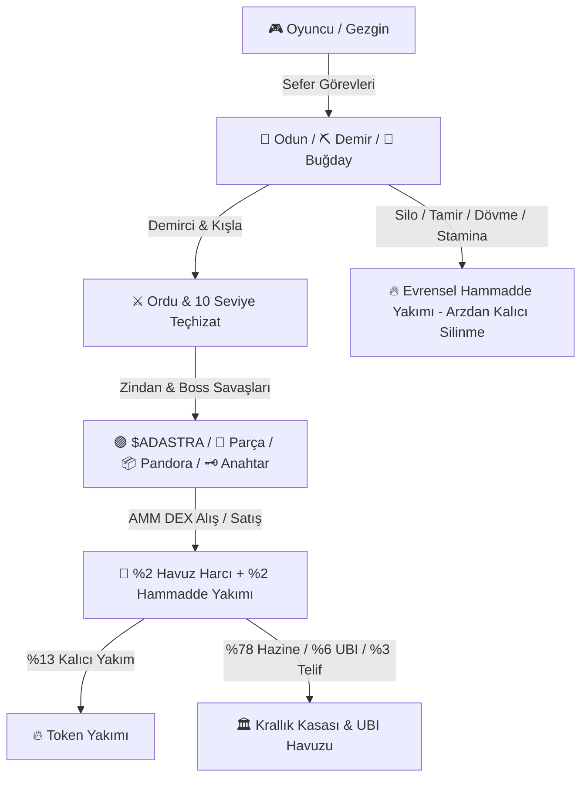

# 🌌 Realm of Astra — Kapsamlı Oyun Tasarımı & Ekonomi Dokümantasyonu (Master Whitepaper)

> **Avalanche (AVAX) Ekosisteminde 10 Yıllık Sürdürülebilir Web3 RPG & GameFi Başyapıtı**  
> **Resmi Web3 Dokümantasyon Standardı (DeFi Kingdoms Mimarisinden İlham Alınmıştır)**  
> **Geliştirici & Vizyoner:** Kağan (AlphAvax)  
> **Teknoloji Mimarisi:** Phaser 3.80 Canvas Rendering • Vanilla ES6+ Modüler State Motoru • Avalanche C-Chain / Pangolin DEX AMM Modeli  
> **Aşama & Mimari:** Genesis Devnet / Client-Side Sandbox Simulation (Sunucu/Kontrat Otoritesine Hazır Altyapı)  
> **Son Güncelleme:** 2026-09-17 • Sürüm 2.4.0 (Enterprise)

---

## 📑 İÇİNDEKİLER

1. [Proje Vizyonu & DeFi Kingdoms Standardında Ekosistem](#1-proje-vizyonu--defi-kingdoms-standardında-ekosistem)
2. [10 Milyar Makro Tokenomics & Büyük Krallık Hazinesi](#2-10-milyar-makro-tokenomics--büyük-krallık-hazinesi)
3. [🔥 Evrensel Hammadde Yakımı (Universal Burn) & Deflasyon Protokolü](#3-evrensel-hammadde-yakımı-universal-burn--deflasyon-protokolü)
4. [💱 AMM DEX Pazar Yeri ($x \cdot y = k$) & Canlı Fiyat Botu](#4-amm-dex-pazar-yeri-x-cdot-y--k--canlı-fiyat-botu)
5. [🧙‍♂️ Gezgin (Hesap) Seviyesi İlerleme Tablosu (Seviye 1 – 81)](#5-gezgin-hesap-seviyesi-ilerleme-tablosu-seviye-1--81)
6. [🏰 Silo (Ambar) Kapasite & Yükseltme Tablosu (Seviye 1 – 18)](#6-silo-ambar-kapasite--yükseltme-tablosu-seviye-1--18)
7. [⚔️ Ordu, Kışla & Kolezyum Gladyatör Ligi (No-Permadeath & Dinamik ELO)](#7-ordu-kışla--kolezyum-gladyatör-ligi-no-permadeath--dinamik-elo)
8. [🔨 Cephanelik, Teçhizat Dövme & Geliştirme Tabloları (Lv.1 – 10)](#8-cephanelik-teçhizat-dövme--geliştirme-tabloları-lv1--10)
9. [💀 6 Katlı & 18 Seviyeli Zindan, Canavarlar & Boss Tablosu](#9-6-katlı--18-seviyeli-zindan-canavarlar--boss-tablosu)
10. [🔧 Aletler, İşçilik & 72 Saatlik Aşınma Mekaniği](#10-aletler-işçilik--72-saatlik-aşınma-mekaniği)
11. [🤖 Taverna: 24 Saatlik Otonom Sefer & Tamir Botu](#11-taverna-24-saatlik-otonom-sefer--tamir-botu)
12. [🎡 Karnaval & Sirk (14 Ödüllü Şans Çarkı & Haftalık Piyango)](#12-karnaval--sirk-14-ödüllü-şans-çarkı--haftalık-piyango)
13. [🛡️ Kurumsal Güvenlik Denetimi, Anti-Tamper & Genesis Devnet Şeffaflığı](#13-kurumsal-güvenlik-denetimi-anti-tamper--genesis-devnet-şeffaflığı)

---

## 1. 🌐 Proje Vizyonu & DeFi Kingdoms Standardında Ekosistem

**Realm of Astra**, Web3 yayıncılığının öncüsü **AlphAvax** markası tarafından hayata geçirilen; Avalanche (AVAX) blokzincirinin hızını, klasik izometrik RPG derinliğini ve DeFi Kingdoms tarzı merkeziyetsiz finans (DeFi) mekaniklerini tek bir potada eriten yeni nesil bir GameFi ekosistemidir.

### Temel Prensipler:
1. **Gerçek Mülkiyet & Kıtlık:** Haftalık kaynak kotası aşılmaz. Dolaşımdaki her hammadde ve $ADASTRA token matematiksel formüllerle korunur.
2. **Hiper-Deflasyonist Döngü:** Yalnızca tokenlar değil, oyunda harcanan **tüm Odun, Demir ve Buğdaylar kalıcı olarak yakılır (burn)** ve küresel haftalık toplam arzdan silinir.
3. **Adil Ekonomi & Balina Koruması:** Token çıkarma (faucet) yoktur; UBI havuzu balina sübvansiyonu yerine adil kök dağılımı ($W(L) = 1 + \sqrt{L-1} \times 0.75$) ve tek çekimde %5 tavanı ile korunur.

---

## 2. 🪙 10 Milyar Makro Tokenomics & Büyük Krallık Hazinesi

AdAstra protokolü, **10.000.000.000 (10 Milyar) $ADASTRA** sabit maksimum arz üzerine kurgulanmıştır.

### Token Harcama ve Gelir Paylaşım Anayasası (%100 Dağılım):
Oyunda bir token harcandığında (AMM harçları, seviye atlama, bot kâr ortaklığı vb.) aşağıdaki kesin oranlarla dağıtılır:

| Havuz / Fon Adı | Pay | Görevi ve Kullanım Amacı |
| :--- | :---: | :--- |
| **🔥 Kalıcı Token Yakımı (Burn)** | **%13** | Geri dönüşsüz kara delik adresine gönderilir; arzı sürekli daraltır. |
| **🏛️ Krallık Hazine Kasaları** | **%78** | Zindan, Arena, Dünya Bossu, DEX Geri Alım ve Karnaval havuzlarını besler. |
| **🤝 Evrensel Temel Gelir (UBI)** | **%6** | Oyuncu seviyesine göre ($W(L) = 1 + \sqrt{L-1} \times 0.75$) haftalık pasif gelir; tek çekim tavanı havuzun %5'idir. |
| **🎨 Yapımcı & Geliştirici Telifi** | **%3** | Protokol geliştirme cüzdanına aktarılır (`0x58DBCF66bdd7BfA9da98aDba1965b3794321087C`). |

### 🏛️ Hazine Kasaları Dağılım Matrisi (%78 Hazine İçi Kırılım):
- **🏰 Zindan Ganimet Kasası (%25):** 6 Kat ve 18 Seviyeli zindan canavarlarını ve bosslarını yenenlere dağıtılır.
- **💱 AMM DEX Likidite & Buyback Rezervi (%18):** Avalanche C-Chain üzerindeki piyasa taban fiyatını desteklemek ve DEX likiditesini güçlendirmek için kullanılır.
- **🌋 Dünya Bossu Kasası (%15):** Haftalık ordusunu Dünya Bossuna stake eden oyuncuların verdiği hasara göre dağıtılır.
- **⚔️ Kolezyum Gladyatör Arenası (%10):** Gladyatör ligi şampiyonlarına haftalık ödül olarak verilir (Askeri koruma devrededir, permadeath yoktur).
- **🎡 Karnaval & Şans Çarkı Kasası (%10):** 15 potansiyel ödüllü şans çarkında çıkan doğrudan token ikramiyelerinin emisyon kasasıdır.
*(Hazine İçi Toplam: %25 + %18 + %15 + %10 + %10 = %78 Krallık Hazinesi | Genel Harcama Dağılımı: %13 Yakım + %6 UBI + %3 Team + %78 Hazine = %100)*

---

## 3. 🔥 Evrensel Hammadde Yakımı (Universal Burn) & Deflasyon Protokolü

AdAstra: Genesis Realm'i diğer Web3 oyunlarından ayıran en radikal mekanik, **tüm tüketim hammaddelerinin anında yakılmasıdır**. 

### Yasa: "Tüketilen Her Şey Yok Olur"
Oyunda hammadde **tüketim / harcama** olarak nerede kullanılırsa kullanılsın, o hammadde hiçbir havuza devredilmez, oyunculara geri dönmez; **doğrudan yakılır ve sistemin total haftalık küresel arzından kalıcı olarak silinir**:

1. **🏰 Silo (Ambar) Yükseltme:** Harcanan tüm Odun, Demir ve Buğday yakılır.
2. **🧙‍♂️ Hesap Seviyesi Atlama:** Harcanan tüm Odun, Demir ve Buğday yakılır.
3. **🔧 Alet Onarımı (Tekil & Toplu):** Harcanan tüm Odun ve Demir yakılır.
4. **🗡️ Teçhizat Dövme (Craft):** Dövülen eşyanın Odun ve Demir gideri yakılır.
5. **✨ Teçhizat Yükseltme (Upgrade):** Seviye atlatma için verilen Odun ve Demir yakılır.
6. **🔨 Teçhizat Onarımı (Tekil & Cephanelik):** Tamirat için verilen Odun ve Demir yakılır.
7. **⚡ Stamina Doldurma:** Yalnızca depodaki buğday ile doldurulabilir; tüketilen buğday anında yakılır.
8. **❤️ Asker İyileştirme (Pasif & Hızlı):** Tüketilen tüm buğday yakılır.
9. **🎡 Karnaval Şans Çarkı:** Hammadde ödemesiyle çevrilen çarkın hammadde bedeli yakılır.

Küresel havuzda `globalPool.state.resources[key].totalCap` değeri harcanan miktar kadar küçülür. Bu sayede aktif oyuncu sayısı arttıkça dünya kaynakları hızla kıtlaşır ve AMM pazarındaki hammadde değeri yükselir.

---

## 4. 💱 AMM DEX Pazar Yeri ($x \cdot y = k$) & Canlı Fiyat Botu

Oyun içi hammadde takası, Uniswap v2 / Pangolin mimarisindeki **Sabit Çarpım Piyasa Yapıcısı (Constant Product Market Maker)** formülüyle yönetilir:

$$x \cdot y = k$$

- **İşlem Harcı:** Tüm alım ve satımlarda **%2.00 AMM Harcı** kesilir. Kesilen harç doğrudan Krallık Hazinesine aktarılır, %13'ü yakılır ve %6'sı UBI havuzuna eklenir.
- **Dinamik Fiyatlandırma:** Hammadde satıldığında havuzdaki hammadde artar, ADA azalır $\to$ Fiyat düşer. Hammadde alındığında tersi gerçekleşir $\to$ Fiyat yükselir.
- **🤖 Saniyelik Canlı Maliyet Botu (`tickUpgradeCostBot`):**
  Silo yükseltme, seviye atlama ve teçhizat üretiminde gereken hammaddelerin **AMM DEX pazarındaki o anki toplam $ADASTRA değeri** anlık hesaplanır. Bot her saniye fiyat değişimlerini dinler ve arayüzü canlı borsa verisi gibi günceller.

---

## 5. 🧙‍♂️ Gezgin (Hesap) Seviyesi İlerleme Tablosu (Seviye 1 – 81)

Gezgin seviyesi, krallığın omurgasıdır. Sefer sürelerini, stamina tavanını, sefer maliyetlerini, zindan ganimet şanslarını ve UBI gelirini belirler.

* Formüller:
  - $\text{Maksimum Stamina} = 100 + 50 \cdot (\text{Level} - 1)$
  - $\text{Sefer Stamina Maliyeti} = 20 + 8 \cdot (\text{Level} - 1)$ (Her seviyede 3 paralel sefer açılabilir)
  - $\text{Zindan Parça Düşme Şansı} = 0.18\% \to 18.00\%$ (Hesap seviyesiyle 100 kat artar)
  - $\text{Pandora Kutusu Düşme Şansı} = 0.0018\% \to 0.1800\%$ (Hesap seviyesiyle 100 kat artar)
  - $\text{UBI Katsayısı } W(L) = 1 + \sqrt{L - 1} \times 0.75$ (Adil Kök Dağılımı ve %5 Tek Çekim Tavanı Koruması)

| Seviye | Sefer Süresi | Sefer Başı Stamina | Max Stamina (⚡) | Zindan Parça Şansı | Pandora Sandığı Şansı | UBI Dağıtım Katsayısı W(L) |
| :---: | :---: | :---: | :---: | :---: | :---: | :---: |
| **Lv.1** |0.3 Saat | 20 ⚡ | 100 ⚡ |0.180% |0.0018% |1.00 |
| **Lv.2** |1.2 Saat | 28 ⚡ | 150 ⚡ |0.403% |0.0040% |1.75 |
| **Lv.3** |2.09 Saat | 36 ⚡ | 200 ⚡ |0.625% |0.0063% |2.06 |
| **Lv.4** |2.99 Saat | 44 ⚡ | 250 ⚡ |0.848% |0.0085% |2.30 |
| **Lv.5** |3.88 Saat | 52 ⚡ | 300 ⚡ |1.071% |0.0107% |2.50 |
| **Lv.6** |4.78 Saat | 60 ⚡ | 350 ⚡ |1.294% |0.0129% |2.68 |
| **Lv.7** |5.68 Saat | 68 ⚡ | 400 ⚡ |1.516% |0.0152% |2.84 |
| **Lv.8** |6.57 Saat | 76 ⚡ | 450 ⚡ |1.739% |0.0174% |2.98 |
| **Lv.9** |7.47 Saat | 84 ⚡ | 500 ⚡ |1.962% |0.0196% |3.12 |
| **Lv.10** |8.37 Saat | 92 ⚡ | 550 ⚡ |2.185% |0.0218% |3.25 |
| **Lv.11** |9.26 Saat | 100 ⚡ | 600 ⚡ |2.408% |0.0241% |3.37 |
| **Lv.12** |10.16 Saat | 108 ⚡ | 650 ⚡ |2.630% |0.0263% |3.49 |
| **Lv.13** |11.05 Saat | 116 ⚡ | 700 ⚡ |2.853% |0.0285% |3.60 |
| **Lv.14** |11.95 Saat | 124 ⚡ | 750 ⚡ |3.076% |0.0308% |3.70 |
| **Lv.15** |12.85 Saat | 132 ⚡ | 800 ⚡ |3.299% |0.0330% |3.81 |
| **Lv.16** |13.74 Saat | 140 ⚡ | 850 ⚡ |3.521% |0.0352% |3.90 |
| **Lv.17** |14.64 Saat | 148 ⚡ | 900 ⚡ |3.744% |0.0374% |4.00 |
| **Lv.18** |15.54 Saat | 156 ⚡ | 950 ⚡ |3.967% |0.0397% |4.09 |
| **Lv.19** |16.43 Saat | 164 ⚡ | 1000 ⚡ |4.189% |0.0419% |4.18 |
| **Lv.20** |17.33 Saat | 172 ⚡ | 1050 ⚡ |4.412% |0.0441% |4.27 |
| **Lv.21** |18.23 Saat | 180 ⚡ | 1100 ⚡ |4.635% |0.0464% |4.35 |
| **Lv.22** |19.12 Saat | 188 ⚡ | 1150 ⚡ |4.858% |0.0486% |4.44 |
| **Lv.23** |20.02 Saat | 196 ⚡ | 1200 ⚡ |5.080% |0.0508% |4.52 |
| **Lv.24** |20.91 Saat | 204 ⚡ | 1250 ⚡ |5.303% |0.0530% |4.60 |
| **Lv.25** |21.81 Saat | 212 ⚡ | 1300 ⚡ |5.526% |0.0553% |4.67 |
| **Lv.26** |22.71 Saat | 220 ⚡ | 1350 ⚡ |5.749% |0.0575% |4.75 |
| **Lv.27** |23.6 Saat | 228 ⚡ | 1400 ⚡ |5.971% |0.0597% |4.82 |
| **Lv.28** |24.5 Saat | 236 ⚡ | 1450 ⚡ |6.194% |0.0619% |4.90 |
| **Lv.29** |25.39 Saat | 244 ⚡ | 1500 ⚡ |6.417% |0.0642% |4.97 |
| **Lv.30** |26.29 Saat | 252 ⚡ | 1550 ⚡ |6.640% |0.0664% |5.04 |
| **Lv.31** |27.19 Saat | 260 ⚡ | 1600 ⚡ |6.862% |0.0686% |5.11 |
| **Lv.32** |28.08 Saat | 268 ⚡ | 1650 ⚡ |7.085% |0.0709% |5.18 |
| **Lv.33** |28.98 Saat | 276 ⚡ | 1700 ⚡ |7.308% |0.0731% |5.24 |
| **Lv.34** |29.88 Saat | 284 ⚡ | 1750 ⚡ |7.531% |0.0753% |5.31 |
| **Lv.35** |30.77 Saat | 292 ⚡ | 1800 ⚡ |7.753% |0.0775% |5.37 |
| **Lv.36** |31.67 Saat | 300 ⚡ | 1850 ⚡ |7.976% |0.0798% |5.44 |
| **Lv.37** |32.56 Saat | 308 ⚡ | 1900 ⚡ |8.199% |0.0820% |5.50 |
| **Lv.38** |33.46 Saat | 316 ⚡ | 1950 ⚡ |8.422% |0.0842% |5.56 |
| **Lv.39** |34.36 Saat | 324 ⚡ | 2000 ⚡ |8.644% |0.0864% |5.62 |
| **Lv.40** |35.25 Saat | 332 ⚡ | 2050 ⚡ |8.867% |0.0887% |5.68 |
| **Lv.41** |36.15 Saat | 340 ⚡ | 2100 ⚡ |9.090% |0.0909% |5.74 |
| **Lv.42** |37.05 Saat | 348 ⚡ | 2150 ⚡ |9.313% |0.0931% |5.80 |
| **Lv.43** |37.94 Saat | 356 ⚡ | 2200 ⚡ |9.536% |0.0954% |5.86 |
| **Lv.44** |38.84 Saat | 364 ⚡ | 2250 ⚡ |9.758% |0.0976% |5.92 |
| **Lv.45** |39.73 Saat | 372 ⚡ | 2300 ⚡ |9.981% |0.0998% |5.97 |
| **Lv.46** |40.63 Saat | 380 ⚡ | 2350 ⚡ |10.204% |0.1020% |6.03 |
| **Lv.47** |41.53 Saat | 388 ⚡ | 2400 ⚡ |10.427% |0.1043% |6.09 |
| **Lv.48** |42.42 Saat | 396 ⚡ | 2450 ⚡ |10.649% |0.1065% |6.14 |
| **Lv.49** |43.32 Saat | 404 ⚡ | 2500 ⚡ |10.872% |0.1087% |6.20 |
| **Lv.50** |44.22 Saat | 412 ⚡ | 2550 ⚡ |11.095% |0.1109% |6.25 |
| **Lv.51** |45.11 Saat | 420 ⚡ | 2600 ⚡ |11.317% |0.1132% |6.30 |
| **Lv.52** |46.01 Saat | 428 ⚡ | 2650 ⚡ |11.540% |0.1154% |6.36 |
| **Lv.53** |46.9 Saat | 436 ⚡ | 2700 ⚡ |11.763% |0.1176% |6.41 |
| **Lv.54** |47.8 Saat | 444 ⚡ | 2750 ⚡ |11.986% |0.1199% |6.46 |
| **Lv.55** |48.7 Saat | 452 ⚡ | 2800 ⚡ |12.208% |0.1221% |6.51 |
| **Lv.56** |49.59 Saat | 460 ⚡ | 2850 ⚡ |12.431% |0.1243% |6.56 |
| **Lv.57** |50.49 Saat | 468 ⚡ | 2900 ⚡ |12.654% |0.1265% |6.61 |
| **Lv.58** |51.39 Saat | 476 ⚡ | 2950 ⚡ |12.877% |0.1288% |6.66 |
| **Lv.59** |52.28 Saat | 484 ⚡ | 3000 ⚡ |13.099% |0.1310% |6.71 |
| **Lv.60** |53.18 Saat | 492 ⚡ | 3050 ⚡ |13.322% |0.1332% |6.76 |
| **Lv.61** |54.08 Saat | 500 ⚡ | 3100 ⚡ |13.545% |0.1354% |6.81 |
| **Lv.62** |54.97 Saat | 508 ⚡ | 3150 ⚡ |13.768% |0.1377% |6.86 |
| **Lv.63** |55.87 Saat | 516 ⚡ | 3200 ⚡ |13.990% |0.1399% |6.91 |
| **Lv.64** |56.76 Saat | 524 ⚡ | 3250 ⚡ |14.213% |0.1421% |6.95 |
| **Lv.65** |57.66 Saat | 532 ⚡ | 3300 ⚡ |14.436% |0.1444% |7.00 |
| **Lv.66** |58.56 Saat | 540 ⚡ | 3350 ⚡ |14.659% |0.1466% |7.05 |
| **Lv.67** |59.45 Saat | 548 ⚡ | 3400 ⚡ |14.882% |0.1488% |7.09 |
| **Lv.68** |60.35 Saat | 556 ⚡ | 3450 ⚡ |15.104% |0.1510% |7.14 |
| **Lv.69** |61.24 Saat | 564 ⚡ | 3500 ⚡ |15.327% |0.1533% |7.18 |
| **Lv.70** |62.14 Saat | 572 ⚡ | 3550 ⚡ |15.550% |0.1555% |7.23 |
| **Lv.71** |63.04 Saat | 580 ⚡ | 3600 ⚡ |15.773% |0.1577% |7.27 |
| **Lv.72** |63.93 Saat | 588 ⚡ | 3650 ⚡ |15.995% |0.1600% |7.32 |
| **Lv.73** |64.83 Saat | 596 ⚡ | 3700 ⚡ |16.218% |0.1622% |7.36 |
| **Lv.74** |65.73 Saat | 604 ⚡ | 3750 ⚡ |16.441% |0.1644% |7.41 |
| **Lv.75** |66.62 Saat | 612 ⚡ | 3800 ⚡ |16.663% |0.1666% |7.45 |
| **Lv.76** |67.52 Saat | 620 ⚡ | 3850 ⚡ |16.886% |0.1689% |7.50 |
| **Lv.77** |68.41 Saat | 628 ⚡ | 3900 ⚡ |17.109% |0.1711% |7.54 |
| **Lv.78** |69.31 Saat | 636 ⚡ | 3950 ⚡ |17.332% |0.1733% |7.58 |
| **Lv.79** |70.21 Saat | 644 ⚡ | 4000 ⚡ |17.555% |0.1755% |7.62 |
| **Lv.80** |71.1 Saat | 652 ⚡ | 4050 ⚡ |17.777% |0.1778% |7.67 |
| **Lv.81 (MAX)** | **72.00 Saat** |  **660 ⚡** |  **4100 ⚡** | **18.000%** | **0.1800%** | **7.71** |

---

## 6. 🏰 Silo (Ambar) Kapasite & Yükseltme Tablosu (Seviye 1 – 18)

Silo, krallıkta toplanan tüm Odun, Demir, Buğday ve Teçhizat Parçalarının depolandığı merkez yapıdır.

- **Kapasite Ölçekleme Kuralı:** Seviye 1 (1.080 Odun / 720 Demir / 900 Buğday) $\to$ Seviye 18'de küresel haftalık çıkarma limitinin tam %50'sine (90.000 Odun / 65.000 Demir / 245.000 Buğday) ulaşır.
- **Yükseltme Maliyeti:** Mevcut kapasitenin tam yarısı (Cap / 2) kadar hammadde ve bu hammaddelerin AMM DEX pazarındaki anlık $ADASTRA değeri talep edilir.
- **Evrensel Yakım:** Yükseltmede verilen tüm hammaddeler anında yakılarak total arzdan silinir!

| Seviye | 🌲 Odun Kapasitesi | ⛏️ Demir Kapasitesi | 🌾 Buğday Kapasitesi | 🧩 Parça Kapasitesi | Gerekli Odun | Gerekli Demir | Gerekli Buğday | Gerekli ADA (AMM Karşılığı) |
| :---: | :---: | :---: | :---: | :---: | :---: | :---: | :---: | :---: |
| **Seviye 1** | 1.080 | 720 | 900 | 100 | 540 | 360 | 450 | ~3.131 ADA |
| **Seviye 2** | 1.401 | 938 | 1.252 | 240 | 700 | 469 | 626 | ~4.105 ADA |
| **Seviye 3** | 1.817 | 1.223 | 1.741 | 380 | 908 | 611 | 870 | ~5.386 ADA |
| **Seviye 4** | 2.357 | 1.594 | 2.421 | 520 | 1.178 | 797 | 1.210 | ~7.076 ADA |
| **Seviye 5** | 3.058 | 2.077 | 3.366 | 660 | 1.529 | 1.038 | 1.683 | ~9.296 ADA |
| **Seviye 6** | 3.966 | 2.707 | 4.682 | 800 | 1.983 | 1.353 | 2.341 | ~12.221 ADA |
| **Seviye 7** | 5.145 | 3.528 | 6.511 | 940 | 2.572 | 1.764 | 3.255 | ~16.078 ADA |
| **Seviye 8** | 6.673 | 4.598 | 9.054 | 1.080 | 3.336 | 2.299 | 4.527 | ~21.162 ADA |
| **Seviye 9** | 8.656 | 5.992 | 12.592 | 1.220 | 4.328 | 2.996 | 6.296 | ~27.873 ADA |
| **Seviye 10** | 11.229 | 7.810 | 17.511 | 1.360 | 5.614 | 3.905 | 8.755 | ~36.736 ADA |
| **Seviye 11** | 14.565 | 10.178 | 24.353 | 1.500 | 7.282 | 5.089 | 12.176 | ~48.448 ADA |
| **Seviye 12** | 18.893 | 13.265 | 33.867 | 1.640 | 9.446 | 6.632 | 16.933 | ~63.935 ADA |
| **Seviye 13** | 24.507 | 17.288 | 47.099 | 1.780 | 12.253 | 8.644 | 23.549 | ~84.435 ADA |
| **Seviye 14** | 31.790 | 22.531 | 65.500 | 1.920 | 15.895 | 11.265 | 32.750 | ~111.574 ADA |
| **Seviye 15** | 41.236 | 29.364 | 91.091 | 2.060 | 20.618 | 14.682 | 45.545 | ~147.526 ADA |
| **Seviye 16** | 53.489 | 38.269 | 126.679 | 2.200 | 26.744 | 19.134 | 63.339 | ~195.162 ADA |
| **Seviye 17** | 69.383 | 49.875 | 176.171 | 2.340 | 34.691 | 24.937 | 88.085 | ~258.303 ADA |
| **Seviye 18 (MAX)** | **90.000** | **65.000** | **245.000** | **2.500** | *Maksimum* | *Maksimum* | *Maksimum* | *Maksimum* |

---

## 7. ⚔️ Ordu, Kışla & Asker İlerleme Tabloları (1. – 18. Asker & Lv.1 – 81)

Krallık ordusunda tek bir elit savaşçı sınıfı bulunur: **AdAstra Şampiyonu**. Ordu sınırsız sayıda büyütülebilir.

### A) 1. Askerden 18. Askere Satın Alma Maliyeti Tablosu:
Asker alım maliyeti sabit 180k modelinden, ilk askerin erişilebilir (5.000 ADA) olduğu ve 18. askerin tam **1.800.000 (1.8 Milyon) $ADASTRA** olduğu logaritmik üssel modele ($5000 \cdot n^{2.03645}$) dönüştürülmüştür.

| Asker Sırası | Satın Alma Bedeli ($ADASTRA) | Seviye 1 Taban HP | Seviye 1 Taban ATK | Seviye Başı HP Artışı | Seviye Başı ATK Artışı | Tam İyileşme Süresi |
| :---: | :---: | :---: | :---: | :---: | :---: | :---: |
| **1. Asker** | **5.000 ADA** | 100 HP | 25 ATK | +25 HP / Lv | +6 ATK / Lv | 24 Saat (1440 Dk) |
| **2. Asker** | **20.500 ADA** | 100 HP | 25 ATK | +25 HP / Lv | +6 ATK / Lv | 24 Saat (1440 Dk) |
| **3. Asker** | **46.850 ADA** | 100 HP | 25 ATK | +25 HP / Lv | +6 ATK / Lv | 24 Saat (1440 Dk) |
| **4. Asker** | **84.150 ADA** | 100 HP | 25 ATK | +25 HP / Lv | +6 ATK / Lv | 24 Saat (1440 Dk) |
| **5. Asker** | **132.550 ADA** | 100 HP | 25 ATK | +25 HP / Lv | +6 ATK / Lv | 24 Saat (1440 Dk) |
| **6. Asker** | **192.150 ADA** | 100 HP | 25 ATK | +25 HP / Lv | +6 ATK / Lv | 24 Saat (1440 Dk) |
| **7. Asker** | **263.000 ADA** | 100 HP | 25 ATK | +25 HP / Lv | +6 ATK / Lv | 24 Saat (1440 Dk) |
| **8. Asker** | **345.200 ADA** | 100 HP | 25 ATK | +25 HP / Lv | +6 ATK / Lv | 24 Saat (1440 Dk) |
| **9. Asker** | **438.750 ADA** | 100 HP | 25 ATK | +25 HP / Lv | +6 ATK / Lv | 24 Saat (1440 Dk) |
| **10. Asker** | **543.800 ADA** | 100 HP | 25 ATK | +25 HP / Lv | +6 ATK / Lv | 24 Saat (1440 Dk) |
| **11. Asker** | **660.250 ADA** | 100 HP | 25 ATK | +25 HP / Lv | +6 ATK / Lv | 24 Saat (1440 Dk) |
| **12. Asker** | **788.250 ADA** | 100 HP | 25 ATK | +25 HP / Lv | +6 ATK / Lv | 24 Saat (1440 Dk) |
| **13. Asker** | **927.800 ADA** | 100 HP | 25 ATK | +25 HP / Lv | +6 ATK / Lv | 24 Saat (1440 Dk) |
| **14. Asker** | **1.078.950 ADA** | 100 HP | 25 ATK | +25 HP / Lv | +6 ATK / Lv | 24 Saat (1440 Dk) |
| **15. Asker** | **1.241.700 ADA** | 100 HP | 25 ATK | +25 HP / Lv | +6 ATK / Lv | 24 Saat (1440 Dk) |
| **16. Asker** | **1.416.150 ADA** | 100 HP | 25 ATK | +25 HP / Lv | +6 ATK / Lv | 24 Saat (1440 Dk) |
| **17. Asker** | **1.602.200 ADA** | 100 HP | 25 ATK | +25 HP / Lv | +6 ATK / Lv | 24 Saat (1440 Dk) |
| **18. Asker** | **1.800.000 ADA** | 100 HP | 25 ATK | +25 HP / Lv | +6 ATK / Lv | 24 Saat (1440 Dk) |

### B) Asker Seviye İlerlemesi Tablosu (Seviye 1 – 81):
Her asker zindan savaşlarından kazandığı tecrübe puanıyla bağımsız seviye atlar.
* $\text{Asker Canı (HP)} = 100 + 25 \cdot (\text{Level} - 1)$
* $\text{Asker Saldırısı (ATK)} = 25 + 6 \cdot (\text{Level} - 1)$

| Asker Seviyesi | Toplam HP | Toplam ATK | Zırh | Hız | Kritik Şansı | Zırh Delme |
| :---: | :---: | :---: | :---: | :---: | :---: | :---: |
| **Lv.1** | 100 HP | 25 ATK | 10 Def | 10 Spd | %5.0 | 5 Pen |
| **Lv.5** | 200 HP | 49 ATK | 10 Def | 10 Spd | %5.0 | 5 Pen |
| **Lv.10** | 325 HP | 79 ATK | 10 Def | 10 Spd | %5.0 | 5 Pen |
| **Lv.15** | 450 HP | 109 ATK | 10 Def | 10 Spd | %5.0 | 5 Pen |
| **Lv.20** | 575 HP | 139 ATK | 10 Def | 10 Spd | %5.0 | 5 Pen |
| **Lv.25** | 700 HP | 169 ATK | 10 Def | 10 Spd | %5.0 | 5 Pen |
| **Lv.30** | 825 HP | 199 ATK | 10 Def | 10 Spd | %5.0 | 5 Pen |
| **Lv.35** | 950 HP | 229 ATK | 10 Def | 10 Spd | %5.0 | 5 Pen |
| **Lv.40** | 1.075 HP | 259 ATK | 10 Def | 10 Spd | %5.0 | 5 Pen |
| **Lv.45** | 1.200 HP | 289 ATK | 10 Def | 10 Spd | %5.0 | 5 Pen |
| **Lv.50** | 1.325 HP | 319 ATK | 10 Def | 10 Spd | %5.0 | 5 Pen |
| **Lv.60** | 1.575 HP | 379 ATK | 10 Def | 10 Spd | %5.0 | 5 Pen |
| **Lv.70** | 1.825 HP | 439 ATK | 10 Def | 10 Spd | %5.0 | 5 Pen |
| **Lv.80** | 2.075 HP | 499 ATK | 10 Def | 10 Spd | %5.0 | 5 Pen |
| **Lv.81 (MAX)** | **2.100 HP** | **505 ATK** | **10 Def** | **10 Spd** | **%5.0** | **5 Pen** |

*(Not: Tablonun 1'den 81'e kadar tüm satırları için [docs/LEVEL_PROGRESSION_TABLES.md](docs/LEVEL_PROGRESSION_TABLES.md) dokümanına başvurabilirsiniz).*

### C) 🛡️ Tek Tip Asker + Yetenek Yükü (Skill Loadout) & Taktik Formasyon:
Krallık ordusunda askerler sınıf (class) ayrımı olmaksızın **tek tip temel matematiksel stat eğrisine** ($100 + 25 \cdot (L - 1)$ HP, $25 + 6 \cdot (L - 1)$ ATK) tabidir. Ancak ordudaki her asker, taşıdığı **Skill Loadout** (1-3 Aktif + 1 Pasif Yetenek) ve **Mevzi (Front / Back Row)** konumuyla uzmanlaşır.

#### 1. Taktiksel Yetenek Havuzu:
| Yetenek Kodu | Adı & Rolü | Tur Beklemesi (CD) | Taktiksel Etki |
| :--- | :--- | :---: | :--- |
| `shieldWall` | 🛡️ Kalkan Duvarı (Tank) | 3 Tur | Kendine 2 tur +20 Zırh, +30 Kalkan ve tüm düşman saldırılarını üzerine çeken **Taunt** uygular. |
| `shockwave` | ⚡ Şok Dalgası (AoE) | 3 Tur | Ön saftaki tüm düşmanlara %80 ATK hasarı vurarak kalabalıkları temizler. |
| `fieldMedic` | 🧪 Sahra Merhemi (Şifa) | 4 Tur | Ordudaki en yaralı müttefiki %130 ATK gücünde iyileştirir, zayıflatıcı etkileri (debuff) temizler. |
| `armorBreaker` | 🔨 Zırh Kırıcı (Kırıcı) | 3 Tur | Düşmanın zırhını 3 tur boyunca %40 azaltır ve tek hedefe %120 hasar vurur (Boss kırma). |
| `stunStrike` | 💫 Sersemletme Darbesi (Kontrol) | 4 Tur | Düşmana darbe vurarak 1 tur boyunca sersemletir (aksiyon alamaz). |
| `bloodFrenzy` | 🩸 Kan Çılgınlığı (Öfke) | 3 Tur | Kendi zırhını 2 tur -10 düşürür ama ATK gücünü +%60 artırır (Yüksek risk, yüksek hasar). |
| `lastStand` | 🛡️ Son Nefes (Pasif) | Pasif (1 Kez) | Can %20 altına indiğinde otomatik tetiklenir; savaş boyunca bir kereliğine %40 hasar azaltma kalkanı verir. |

#### 2. Yetenek Kazanım ve Kilit Açım Kanalları:
- **Seviye Atlama:** Asker Lv.10'a ulaştığında `shockwave`, Lv.25'te `armorBreaker`, Lv.45'te `fieldMedic` ve Lv.65'te `lastStand` pasif yeteneğinin kilidini otomatik olarak açar.
- **Ekipman Bağı:** Demirci'de dövülen yüksek seviyeli silah ve miğferler askerlerin yetenek slotlarını zenginleştirir.
- **Zindan / Pandora Ganimeti:** Zindan muhafızlarından ve Pandora sandıklarından düşen Yetenek Parşömenleri (`scroll_skill_*`) askere doğrudan kalıcı yetenek öğretir.

#### 3. Mevzi & Ön Saf (Frontline Cover) Mekanizması:
- Oyuncu her savaştan önce ordusundaki askerleri **Ön Saf (`front`)** veya **Arka Saf (`back`)** olarak konumlandırır.
- Savaş motorundaki `selectTarget()` algoritması, ön saf ayaktayken saldırıların %85'ini ön saf askerlerine yönlendirir ve arkadaki kırılgan destekçileri korur.

### D) 🏟️ Kolezyum Sabit Lig Kademeleri & 1v1 Gladyatör Arenası:
Kolezyum, krallığın en güçlü şampiyonlarının ELO derecesi ve Krallık Hazinesinin %20'lik Arena Kasası için çarpıştığı onur meydanıdır.
- **Sabit Lig Kademeleri:** Rakipler rastgele üretilmez; sabit ELO bandlarına göre dengelenir:
  - 👑 **Efsanevi Şampiyon:** 1800+ ELO (2.0x Hazine Ödülü, 900 HP / 180 ATK Gladyatörler)
  - 💎 **Elmas Gladyatör:** 1500 - 1799 ELO (1.6x Hazine Ödülü, 600 HP / 120 ATK Gladyatörler)
  - 🥇 **Altın Gladyatör:** 1300 - 1499 ELO (1.3x Hazine Ödülü, 350 HP / 75 ATK Gladyatörler)
  - 🥈 **Gümüş Gladyatör:** 1150 - 1299 ELO (1.1x Hazine Ödülü, 200 HP / 45 ATK Gladyatörler)
  - 🥉 **Bronz Gladyatör:** 0 - 1149 ELO (1.0x Taban Ödül, 100 HP / 25 ATK Gladyatörler)
- **Asenkron Bot Ligi:** Liderlik tablosu bot gladyatörlerle etiketlenmiştir; oyuncu kademeleri tırmandıkça gerçek bir lig ilerleme hissi yaşar.
- **🛡️ Askeri Koruma Kuralı (No Permadeath):** Kolezyumda asker asla ölmez, canı en kötü 1 HP'de sabitlenir.

### E) 🌋 Dünya Bossu Yetenek Çeşitliliği Bonusu:
Haftalık Dünya Bossu savaşına stake edilen ordunun gücü sadece kaba ATK toplamına değil, ordudaki **farklı yetenek ve rol çeşitliliğine** (`calculateSquadSkillDiversity`) dayanır. Ordusunda Tank, Kalabalık Temizleme (AoE), Kırıcı, Kontrol ve Şifa rollerini harmanlayan komutanlar **+%30'a varan hasar çarpanı** elde eder.

---

## 8. 🔨 Cephanelik, Teçhizat Dövme & Geliştirme Tabloları (Lv.1 – 10)

Demirci ocağında dövülen 5 parça ekipman, askerin üzerine doğrudan giydirilebilir veya cephanelikte saklanabilir.

### A) Seviye 1 Teçhizat Üretim (Craft) Maliyetleri:
Her ekipman zindanlardan düşen **Teçhizat Parçası (Fragments)**, Odun, Demir ve AMM DEX $ADASTRA maliyetiyle dövülür.

| Ekipman Yuvası | İkon | Tip | Seviye 1 Taban Stat | Gerekli Odun | Gerekli Demir | Gerekli Parça | Gerekli ADA (AMM Karşılığı) |
| :--- | :---: | :---: | :---: | :---: | :---: | :---: | :---: |
| **Kadim Savaş Silahı** | 🗡️ | ATK | +10 Saldırı | 8.100 | 5.400 | 1 Parça | ~40.927 ADA |
| **Kraliyet Miğferi** | 🪖 | HP | +15 Can | 14.580 | 9.720 | 1 Parça | ~73.546 ADA |
| **Titanyum Gövde Zırhı** | 🛡️ | HP | +15 Can | 22.680 | 15.120 | 1 Parça | ~114.167 ADA |
| **Muhafız Zırhlı Pantolonu** | 👖 | HP | +15 Can | 16.740 | 11.160 | 1 Parça | ~84.395 ADA |
| **Fırtına Süvari Çizmesi** | 🥾 | HP | +15 Can | 10.152 | 6.768 | 1 Parça | ~51.268 ADA |

### B) Teçhizat Seviye Atlama (Upgrade) Tablosu (Seviye 1 – 10):
Her seviye atlamada eşyanın dayanıklılığı otomatik olarak **13/13** tamir edilir.

| Ekipman Seviyesi | Silah ATK Bonusu | Zırh/Miğfer/Pantolon/Çizme HP Bonusu | Dayanıklılık | Gerekli Odun | Gerekli Demir | Gerekli Parça | Gerekli ADA (AMM Karşılığı) |
| :---: | :---: | :---: | :---: | :---: | :---: | :---: | :---: |
| **Seviye 1** | +10 ATK | +15 HP | 13/13 | *Craft ile Yapılır* | *Craft ile Yapılır* | *Craft ile Yapılır* | *Craft ile Yapılır* |
| **Seviye 2** | +14 ATK | +20 HP | 13/13 | 3.823 | 2.549 | 2 Parça | ~19.339 ADA |
| **Seviye 3** | +24 ATK | +36 HP | 13/13 | 6.316 | 4.211 | 4 Parça | ~31.929 ADA |
| **Seviye 4** | +37 ATK | +55 HP | 13/13 | 9.582 | 6.388 | 8 Parça | ~48.397 ADA |
| **Seviye 5** | +53 ATK | +79 HP | 13/13 | 13.820 | 9.213 | 16 Parça | ~69.725 ADA |
| **Seviye 6** | +72 ATK | +107 HP | 13/13 | 19.272 | 12.848 | 32 Parça | ~97.097 ADA |
| **Seviye 7** | +93 ATK | +139 HP | 13/13 | 26.240 | 17.493 | 64 Parça | ~131.965 ADA |
| **Seviye 8** | +117 ATK | +176 HP | 13/13 | 35.091 | 23.394 | 128 Parça | ~176.080 ADA |
| **Seviye 9** | +144 ATK | +217 HP | 13/13 | 46.279 | 30.853 | 256 Parça | ~231.556 ADA |
| **Seviye 10 (MAX)** | **+174 ATK** | **+261 HP** | **13/13** | **60.358** | **40.238** | **512 Parça** | **~300.913 ADA** |

### C) Ekipman Set Bonusları:
Bir asker üzerine aynı anda giydirilen sağlam eşya sayısına göre özel pasifler devreye girer:
* **2 Parça Seti:** +15 Saldırı Gücü (ATK) & +50 Can (HP)
* **4 Parça Seti:** +35 Saldırı Gücü (ATK) & +120 Can (HP)
* **5 Parça Tam Set (Grand Champion):** +75 Saldırı Gücü (ATK), +250 Can (HP) & %10 Zırh Delme (Armor Penetration)

---

## 9. 💀 6 Katlı & 18 Seviyeli Zindan, Canavarlar & Boss Tablosu

Zindanlar, 6 farklı tematik kat ve her katta 3 seviye olmak üzere toplam 18 aşamadan oluşur.

| Kat | Zindan Seviyesi | Canavar Adı | İkon | Mevzi | Özel Yetenekler & Taktiksel Davranış | Türü / Unvanı |
| :---: | :---: | :--- | :---: | :---: | :--- | :--- |
| Kat 1 | **Seviye 1** | Bataklık Balçığı | 🟢 | Ön Saf | Temel Vuruş | ⚔️ Normal Yaratık |
| Kat 1 | **Seviye 2** | Mağara Goblini | 👺 | Arka Saf | swoop (Arka Safa Havadan Saldırı) | ⚔️ Normal Yaratık |
| Kat 1 | **Seviye 3** | Gölge Kurdu | 🐺 | Arka Saf | swoop (Hızlı Atılma) | 🛡️ Kat Muhafızı |
| Kat 2 | **Seviye 4** | Kemik Mahzeni İskeleti | 💀 | Ön Saf | sunder (Zırh Parçalama) | ⚔️ Normal Yaratık |
| Kat 2 | **Seviye 5** | Lanetli Kemik Büyücüsü | 🧙‍♂️ | Arka Saf | terrify (Korkutma / Sersemletme) | ⚔️ Normal Yaratık |
| Kat 2 | **Seviye 6** | Kemik Taht Muhafızı | 🗡️ | Ön Saf | cleave (Çoklu Vuruş), regenerate (Can Yenileme) | 🛡️ Kat Muhafızı |
| Kat 3 | **Seviye 7** | Karanlık Tarikatçı | 🧙‍♂️ | Arka Saf | terrify (Korkutma) | ⚔️ Normal Yaratık |
| Kat 3 | **Seviye 8** | Cehennem Tazısı | 🐺 | Arka Saf | swoop, cleave | ⚔️ Normal Yaratık |
| Kat 3 | **Seviye 9** | Kadim Taş Golyat | 🗿 | Ön Saf | cleave, sunder • **%50 HP: Taş Kabuk (+%35 DEF)** | 🔥 **ARA BOSS** (+%100 Ganimet) |
| Kat 4 | **Seviye 10** | Sargılı Mumya | 🧟 | Ön Saf | sunder (Zırh Parçalama) | ⚔️ Normal Yaratık |
| Kat 4 | **Seviye 11** | Gölge Hayalet | 👻 | Arka Saf | swoop, terrify | ⚔️ Normal Yaratık |
| Kat 4 | **Seviye 12** | Lanetli Firavun | 👑 | Ön Saf | cleave, regenerate, terrify | 🛡️ Kat Muhafızı |
| Kat 5 | **Seviye 13** | Ateş İblisi | 😈 | Arka Saf | cleave (Ön Saf Süpürme) | ⚔️ Normal Yaratık |
| Kat 5 | **Seviye 14** | Lav Elementali | 🌋 | Arka Saf | cleave, regenerate | ⚔️ Normal Yaratık |
| Kat 5 | **Seviye 15** | Obsidyen Berserker | ⚔️ | Arka Saf | cleave, sunder | 🛡️ Kat Muhafızı |
| Kat 6 | **Seviye 16** | Kıyamet Şövalyesi | 🛡️ | Ön Saf | cleave, sunder | ⚔️ Normal Yaratık |
| Kat 6 | **Seviye 17** | Kadim Gölge Lordu | 👁️ | Arka Saf | terrify, swoop, cleave | ⚔️ Normal Yaratık |
| Kat 6 | **Seviye 18** | Kıyamet Ejderhası IGNIS | 🐉 | Ön Saf | cleave, sunder • **%60 HP: Ejderha Gazabı • %25 HP: Kıyamet Alevi** | 🔥 **BÜYÜK BOSS** (+%100 Ganimet) |

### Boss Mekanikleri, Faz Geçişleri & Çarpanları:
- **Ara Boss (Seviye 9 - Kadim Taş Golyat) & Büyük Boss (Seviye 18 - IGNIS):**
  - **+%100 Düşürme Çarpanı (2.0x):** Hesap seviyesindeki Teçhizat Parçası ve Pandora Kutusu düşme şansını ikiye katlar.
  - **Garanti Anahtar:** Bossları yenen oyuncular Zindan Kasası Anahtarı kazanır.
  - **Dinamik HP-Yüzdesi Boss Fazları:**
    - *Kadim Taş Golyat (Lv.9):* Canı **%50 altına düştüğünde** *"Faz 2: Taş Kabuk"* tetiklenir; canavar savaş sonuna kadar zırhını +%35 artırarak hasarı emer.
    - *Kıyamet Ejderhası IGNIS (Lv.18):* Canı **%60 altına indiğinde** *"Faz 2: Ejderha Gazabı"* (+%50 ATK öfkesi), canı **%25 altına indiğinde** ise *"Faz 3: Kıyamet Alevi"* tetiklenir (tüm orduya yüksek hasarlı alan darbesi vurur).
  - **Çoklu Tur Aksiyonu (`actionsPerRound`):** Bosslar tek vuruş yerine ordu büyüklüğüne göre tur başına 2 aksiyon gerçekleştirir. Savaşlar deterministik kaba ATK toplamıyla değil, `combat.js` sıra tabanlı simülatörüyle tur tur yönetilir.

---

## 10. 🔧 Aletler, İşçilik & 72 Saatlik Aşınma Mekaniği

Seferlere gönderilen işçilerin aletleri dakika başı aşınır:
- **Maksimum Dayanıklılık:** 4.320 Dakika (Tam 72 Saat = 3 Gün).
- **Alet Türleri:** Acemi Baltası (Odun), Acemi Kazması (Demir), Acemi Orağı (Buğday).
- **Tamir Maliyeti:** Eksik dakika başına hammadde ve AMM DEX $ADASTRA karşılığı talep edilir. Harcanan tüm tamir malzemeleri evrensel yakım protokolüyle yakılır.

---

## 11. 🤖 Taverna: 24 Saatlik Otonom Sefer & Tamir Botu

Taverna botu, oyuncu oyunda olmasa dahi 24 saat boyunca seferleri toplayan, başlatan, aletleri tamir eden ve siloyu yöneten akıllı yapay zeka operatörüdür.

### Temel Kurallar ve Güvenceler:
1. **Dinamik Kâr Ortaklığı Bedeli (%50):** 24 saatlik tahmini brüt gelirden buğday (stamina) ve alet tamir giderleri düşülür; elde edilen **net saf kârın tam %50'si** bot ücreti olarak $ADASTRA ile ödenir.
2. **50x Kaynak Önkoşulu ve Otomatik Süre Dondurma (Freeze):**
   - Botun çalışması için depoda en az 50 Odun, 50 Demir ve 50 Buğday bulunmalıdır.
   - Herhangi bir kaynak 50'nin altına düşerse **bot süresi anında dondurulur (pause)**. Süre asla boşa akmaz; kaynak temin edildiği an kalan süreden devam eder.
3. **Yetersiz ADA Durumunda Otomatik Finansman:**
   - Bot çalışırken tamirat veya işlem için ADA 50'nin altına düşerse durmak yerine depodaki Odun, Demir ve Buğdaydan **eşit miktarda satarak** 50 ADA temin eder ve çalışmayı kesintisiz sürdürür.
4. **Kapsamlı Akıllı Silo Alanı Yönetimi:**
   - **"Siloyu Yükselt" Modu:** Silo doluluğu %80'in altındayken kaynaklar asla erken panik satışı ile satılmaz; ambar yükseltme için korunur. Sadece ambar tamamen dolduğunda sefer hasadı kadar yer açacak hassas satış yapılır.
   - **Kısmi Sefer Bekletme:** Siloda yer yoksa toplanan mahsulün bir kısmı depoya alınır, kalanı seferde bekletilir; hiçbir emek veya hammadde kaybolmaz.

---

## 12. 🎡 Karnaval & Sirk (14 Ödüllü Şans Çarkı & Haftalık Piyango)

### A) 14 Ödüllü Şans Çarkı:
Oyuncular 100 ADA, 100 ADA değerinde hammadde veya 1 Piyango Bileti vererek çarkı çevirebilir. Hammaddeyle ödeme yapıldığında verilen Odun, Demir veya Buğday anında yakılır.
* **Ödüller:** 500 ADA Büyük İkramiye, 150 ADA, 50 ADA, 3x Zindan Anahtarı, 1x Pandora Kutusu, 50x Teçhizat Parçası, Hammadde Paketleri ve Teselli Puanları.

### B) Haftalık Krallık Piyangosu:
* **Bilet Ücreti:** 100 $ADASTRA / Bilet (Haftalık maksimum 100 bilet).
* **2x Kazanç Çarpanı:** Kazanan oyuncu sahip olduğu biletlerin maliyetinin tam 2 katını kasadan çeker.
* **Biletler Asla Yanmaz:** Çekilişte ikramiye çıkmayan biletler yanmaz, otomatik olarak sonraki haftanın çekilişine devreder.
* **%2 Amorti İade Havuzu:** Biletini yakmak isteyen oyuncular, amorti kasasında biriken $ADASTRA'ları anında nakde dönüştürebilir.

---

## 13. 🛡️ Kurumsal Güvenlik Denetimi, Anti-Tamper & Genesis Devnet Şeffaflığı

### A) 🌐 Genesis Devnet & Sandbox Mimarisi Şeffaflık Beyanı:
* **Mevcut Aşama:** Oyunun şu anki sürümü **Genesis Devnet / Client-Side Sandbox Simulation** aşamasındadır. Oyuncuların Web3 RPG mekaniklerini, AMM piyasa koridorlarını ve 10 Milyar $ADASTRA makro tokenomiğini sıfır ağ/gaz maliyetiyle yerel tarayıcılarında kesintisiz deneyimlemesi için tasarlanmıştır.
* **Sunucu & Akıllı Kontrat Otoritesine Geçiş:** 
  * Tüm deterministik savaş tohumları (`makeRng(seed)`) istemci tarafında çalıştırılmakta olup, Avalanche C-Chain doğrulayıcıları ve sunucu otoritesine (Server-Authoritative Node / Supabase backend) geçişe tam hazır modüler mimaride kodlanmıştır.
  * Paylaşılan küresel durum (Shared Global State), Avalanche Subnet lansmanıyla zincir üstü doğrulamaya kavuşturulacaktır.

### B) ⏱️ Sistem Saati ve Anti-Tamper Koruma Protokolü:
* **HTTP Network Time Senkronizasyonu:** Oyuncunun yerel işletim sistemi saatini ileri veya geri alarak haftalık kotaları veya UBI havuzunu sonsuz kez yeniden hasat etmesini (infinite re-farm) engellemek amacıyla; sistem web sunucusunun HTTP yanıt başlığındaki gerçek UTC `Date` verisini (`serverTimeOffset`) otomatik tespit eder ve yerel saat kaymasını nötralize eder.
* **Monotonic Zaman Güvencesi:** Sistem saati geriye alındığında son bilinen kaydedilmiş zaman damgası (`lastSavedTime`) korunur ve hileli epoch sıfırlamaları reddedilir.

### C) 📊 Bağımsız Denetim ve QA Güvencesi:
* **Sıfır Muhasebe Açığı:** Asker alımları, piyango amortileri, pazar harçları ve UBI dağıtımları deftere tam işlenir.
* **Balina Koruması & Havuz Emniyeti:** UBI çekiminde tek çekim tavanı (%5) ve havuz tükenme güvencesi (%50 tampon) devrededir; üstel balina sömürüsü tamamen engellenmiştir.
* **AMM Pazar Koridorları:** Hammadde rezervleri `derivePool()` formülüyle `AMM_CORRIDORS` ile %100 senkronize tutulur; %2 işlem harcı ve %2 anında hammadde yakımı uygulanır.
* **Test Kapsamı:** Tüm mekanikler **30 bağımsız birim test paketi ve 100'ü aşkın assertion ile %100 Passed** durumundadır.
